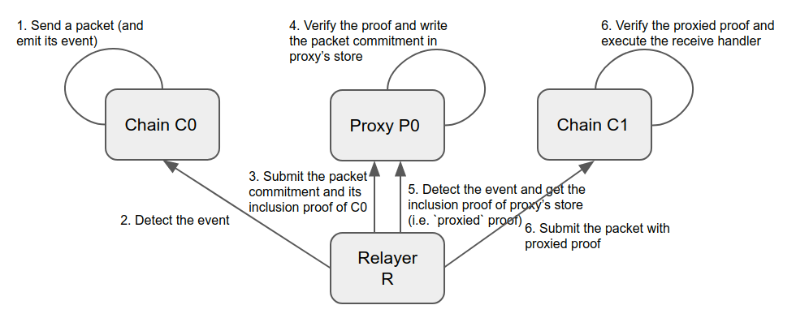
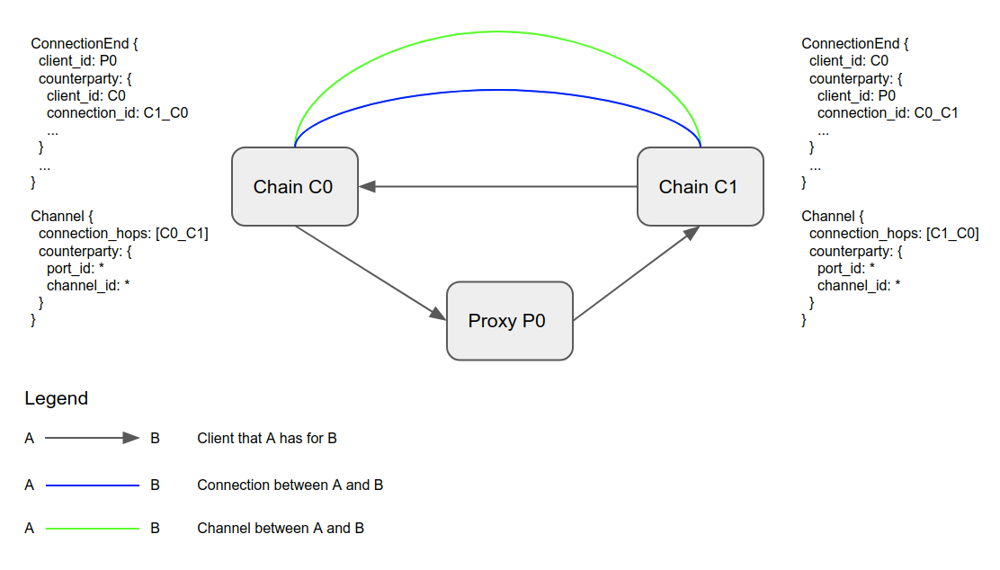

# IBC Proxy


[](https://pkg.go.dev/github.com/datachainlab/ibc-proxy?tab=doc)

IBC-Proxy is a module to proxy the light client verification between two chains connected by IBC. Also, this allows you to configure a cross-chain hub that supports multi-hop communication (currently 2-hops).

This is an example of implementing [this strategy](https://github.com/cosmos/ibc/tree/ee71d0640c23ec4e05e924f52f557b5e06c1d82f/spec/core/ics-002-client-semantics#proxy-clients).

**This software is still under heavy active development.**

## Overview

In IBC, cross-chain communication is usually achieved by verifying a message from the counterparty chain with a light client and handling it. Since the required light clients are different for each chain, all chains that intend to communicate with a chain need to implement the corresponding light client.

It may not be easy to achieve for some blockchains. The execution environments for smart contracts are diverse, and there are some restrictions on supported languages and constraints on computational resources such as gas prices. In constructing a heterogeneous blockchain network, having the feasible network topology limited by these chain-specific problems is not desirable.

Besides, Hub-and-spoke architecture is often used to achieve cross-chain network, but in the current release of IBC, each zone cannot communicate directly with each other through the hub. For now, we need to implement a per-application routing protocol in the hub.

These problems are because the communication destination and the verification destination are combined in the current IBC. Therefore, IBC-Proxy enables the isolation of verification and communication of the counterparty chain.

IBC-proxy provides the following two components:

1. `Proxy Client` verifies the state of the `Proxy machine` and its commitments (also compliant with ICS-02).
2. `Proxy Module` verifies the state of the counterparty chain and generates a commitment and its proof that can be verified by the `Proxy Client`.

These function as follows:

- A Client on the Proxy machine verifies the `upstream` chain, and the `Proxy Module` generates a `Proxy Commitment` and its proof corresponding to the verification
- The `downstream` chain uses a `Proxy Client` to verifies the commitment instead of verifying the `upstream` chain's directly.

The following figure shows the concept:



The figure shows the case where Proxy P0 verifies Chain C0 and Chain C1 verifies P0. Note that for the reverse direction packet flow, you can select a configuration where C0 verifies C1 directly without Proxy. In that case, an asymmetric verification structure can be realized, where C0 verifies C1 through the Proxy and C1 directly verifies C0.

Therefore, IBC-Proxy provides flexibility in the design of cross-chain network topologies. By introducing the Proxy Module to a cross-chain hub, each chain connected to the hub can realize multi-hop communication with each other through it.

## Demo

- [IBC Relayer support](https://github.com/datachainlab/ibc-proxy-relay)
- Token Transfer(ICS-20) through proxy: https://github.com/datachainlab/ibc-proxy-relay/blob/796833cfc0012645079691eaad5fb16f217300c0/.github/workflows/test.yml#L63

## Definitions

`Proxy Machine` (`Proxy` for short) refers to a machine(or chain) that holds `Proxy Module`.

`Proxy Client` refers to an IBC Client for `Proxy`.

`downstream` refers to a chain has an IBC Client instance corresponding to `Proxy`.

`upstream` refers to a chain to be verified by `Proxy`.

## Spec

### Proxy Commitment

The Proxy Module verifies the commitment of the upstream and if successful, provides the downstream with a commitment on the Proxy that is distinct from the existing commitment of IBC. We call a commitment generated by a Proxy that can be verified by the Proxy Client a "Proxy Commitment".

The commitment of IBC must satisfy the property that a specific path binds a unique value as specified in ics23. For this reason, it is necessary to define the specification of the path in which the Proxy stores the commitment to Downstream separately from the format of each commitment path specified in the IBC.

In the definition of the spec, the following points need to be kept in mind:
1. Multiple different downstreams will refer to the same `Proxy`
2. The same `Proxy` provides the proxy for multiple different upstreams
3. There can be multiple prefixes for a given upstream

The type of Proxy Commitment is mapped one-to-one to various status indicators such as Client, Connection, Channel, etc. as in IBC. In IBC, the commitment path is guaranteed to be it by including an unique identifier in a certain host.

However, since the Proxy must use the identifiers on the upstream, path collisions can occur when different upstreams are supported on one Proxy.

Therefore, in order to obtain a path that is unique, we introduce a new commitment path format as follows:
`/{proxy_prefix}/{upstream_client_id}/{upstream_prefix}/{upstream_commitment_path}`

- `proxy_prefix`
    - Proxy store prefix
- `upstream_client_id`
    - Client ID corresponding to the upstream on the Proxy
- `upstream_prefix`
    - Store prefix of the upstream
- `upstream_commitment_path`
    - IBC Commitment path in the upstream

The downstream builds this path based on the state of the Proxy Client and uses it during verification.

### Proxy Client

The Proxy Client is an IBC Client that verifies the Proxy Commitment.

The Proxy Client tracks the state of the Proxy and upstream as follows:

```protobuf
message ClientState {
  // client state corresponding to proxy
  // the type must implements ClientState interface
  google.protobuf.Any proxy_client_state = 1;
  // client id corresponding to upstream on proxy
  string upstream_client_id = 2;
  // the proxy commitment prefix of the proxy chain.
  ibc.core.commitment.v1.MerklePrefix proxy_prefix = 3;
  // the ibc commitment prefix of the proxy chain
  ibc.core.commitment.v1.MerklePrefix ibc_prefix = 4;
}

message ConsensusState {
  // consensus state corresponding to proxy
  // the type must implements ConsensusState interface
  google.protobuf.Any proxy_consensus_state = 1;
}
```

- The Proxy Client holds the state of the Proxy machine as `proxy_{client_state,consensus_state}` in a field of Any type. This decouples the Proxy Client spec from the specific implementation of the Proxy's consensus algorithm.
- `upstream_client_id` is the client_id of the Client that points to the upstream on the Proxy
- `proxy_prefix` is the prefix of the store that holds the Proxy commitment
- `ibc_prefix` is the prefix of the store that holds the IBC commitment

Note: a full client spec is WIP. The current implementation is [here](./modules/light-clients/xx-proxy/types/client_state.go).

### Connection and Channel structure

When one of the chain uses a Proxy, the downstream side specifies the client_id of the proxy as the client_id of the ConnectionEnd, and the upstream side specifies the client_id of the Proxy as the client_id of the counterparty.

For example, when C0, the downstream side, specifies P0, which refers to the Proxy Client, as the ConnectionEnd.client_id, C1, the upstream side, specifies P0 as the counterparty.client_id as well. The following figure shows such an example:



Note that the Channel structure is unaffected regardless of whether or not a proxy is used, since it does not refer to the client.

### Multi-stage Verification

In the IBC connection handshake, it is required to verify that the counterparty chain correctly tracks self client state and consensus state during ConnOpenTry and ConnOpenAck.

For example, when two chains C0 and C1 perform connection handshake and C1 performs ConnOpenTry, the client to C0 on C1 is used to verify that C0 is tracking a valid client state for C1.

However, when using a Proxy, the downstream does not track the state of the upstream directly, so it cannot be verified in the same way. This is because the downstream tracks the client state for Proxy and the Proxy tracks the client state for the upstream. In other words, when the counterparty chain uses the Proxy client, it is required to verify the client state for the Proxy based on the client state of the counterparty chain, and then verify self client state that the Proxy tracks.

We introduce an extension to the existing IBC Client to make it support such a multi-stage verification scheme. This is achieved by wrapping the existing Client implementation. The details can be found [here](./modules/light-clients/xx-multiv).

### Security assumptions

In any case using IBC-Proxy, an additional trust assumption of trusting the Proxy Machine is required. Therefore, if there is the comparable security, the Proxy Machine should be a chain that guarantees relatively strong security.

## Author

- [Jun Kimura](https://github.com/bluele)
